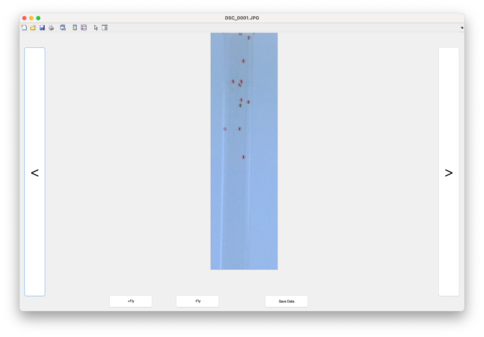

# fly spotter 

This repository contains code that was used for extraction of fly locations in "MED13 and glycolysis are conserved modifiers of α-synuclein-associated neurodegeneration" 


## Installation 

Download and add the following to your MATLAB path:


```
https://github.com/sg-s/movie-analyser
https://github.com/sg-s/fly-spotter/

```


## Usage 


Go to the folder containing `flySpotter` and run the demo using:

```
demo
```

You will see a window asking you to select a crop box to narrow down where the cylinder containing the flies are. Press the "mark crop" button to select this ROI.


Once your rectangular ROI is selected, double click on the rectangle to close the ROI selector and get it running on all images in the chosen folder. 


A new GUI will pop up allowing you to manually inspect the locations of every fly. If a fly is missed, use the "+fly" button to add it. If something is incorrectly labelled as a fly, use the "-fly" button. Finally, use the "Save Data" button to export X,Y and areas of detected flies into a CSV file. 





## License 